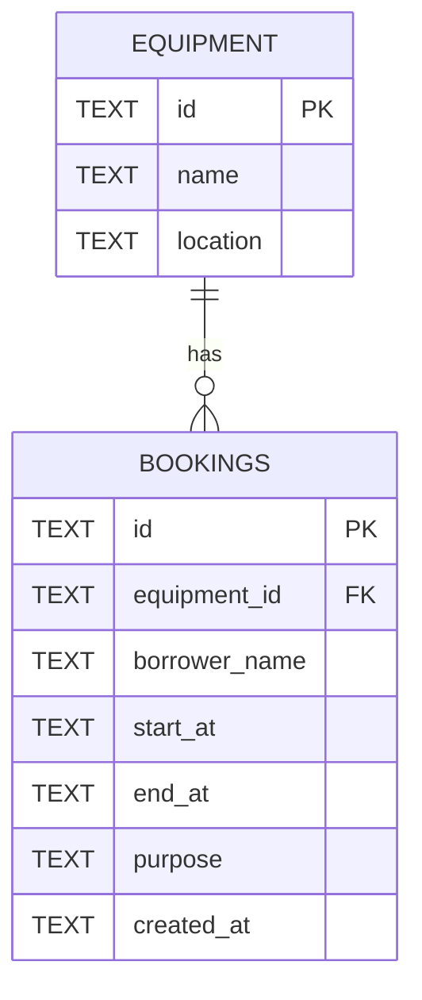

# Campus Equipment Booking API

A small REST API for reserving shared equipment (projectors, cameras, meeting rooms). It prevents the same equipment from being booked for overlapping times.

**Stack:** TypeScript, Hono, Cloudflare Wrangler with local D1 (SQLite).

## Base URL used for testing

```
http://localhost:8787/api
```

## How to run

Requirements: Node.js 18+ and npm.

```cmd
npm install
npx wrangler d1 execute campus-db --local --file=schema.sql
npx wrangler dev
```

1. `npm install` installs Hono and Wrangler.
2. The `d1 execute` command creates the tables and seeds 3 equipment records in the local database. Run it from the project folder.
3. `npx wrangler dev` starts the server on `http://localhost:8787`.

To reset the data: stop the server, delete the `.wrangler\state` folder, and run the `d1 execute` command again.

## Project files

| File | Purpose |
|---|---|
| `src/index.ts` | Hono app: routes, validation, overlap check, error handling |
| `schema.sql` | Tables, index, and seed equipment |
| `wrangler.toml` | Worker config and D1 binding (`DB`) |
| `API_CONTRACT.md` | Endpoints, payloads, status codes, error format |
| `AI_LOG.md` | Record of AI assistance |
| `QUALITY_GATE_REVIEW.md` | Quality Gate findings |
| `evidence.txt` | curl test output (cases 1-23, base URL on the first line) |

## Assumptions

- Times are UTC ISO-8601 strings (e.g. `2026-10-20T09:00:00.000Z`) and are normalised with `toISOString()` before saving.
- Bookings are half-open intervals `[startAt, endAt)`. A booking that starts exactly when another ends is allowed.
- Equipment is seeded by `schema.sql` and is read-only through the API.
- `equipmentId`, `borrowerName`, `startAt`, and `endAt` are required. `purpose` is optional.
- An unknown `equipmentId` returns `404` (resource not found).
- Every error, including unknown routes and unexpected errors, returns `{ "error": "..." }`.

## Data model (ERD)



Seeded equipment: `eq-1` Projector A, `eq-2` Camera Canon R6, `eq-3` Meeting Room 201.

## API summary

Full details are in [API_CONTRACT.md](API_CONTRACT.md).

| Method | Path | Success | Errors |
|---|---|---|---|
| GET | `/equipment` | 200 | - |
| GET | `/bookings` | 200 | - |
| GET | `/bookings/:id` | 200 | 404 |
| POST | `/bookings` | 201 | 400, 404, 409 |
| PATCH | `/bookings/:id` | 200 | 400, 404, 409 |
| DELETE | `/bookings/:id` | 204 | 404 |

`GET /bookings` also accepts an optional `?equipmentId=eq-1` filter.

## How validation works

- **400**: invalid JSON, missing or wrong-type field, invalid date, or `startAt >= endAt`.
- **404**: booking not found, `equipmentId` not found, or unknown route.
- **409**: the time range overlaps an existing booking for the same equipment.
- **Overlap rule:** two bookings overlap when `existing.start < new.end AND existing.end > new.start`. On update, the booking's own id is excluded from the check.
- **PATCH** loads the stored booking, merges the changes over it, and validates the merged result. This means sending only `endAt` is still checked against the stored `startAt`.
- All SQL uses parameter binding (`.bind(...)`). Request data is never concatenated into SQL.

## Testing

Tested with `curl` in Windows CMD. Results for 23 cases (success and error) are in `evidence.txt`. Example:

```cmd
curl -i -X POST http://localhost:8787/api/bookings -H "Content-Type: application/json" -d "{\"equipmentId\":\"eq-1\",\"borrowerName\":\"Somchai Jaidee\",\"startAt\":\"2026-10-20T09:00:00.000Z\",\"endAt\":\"2026-10-20T11:00:00.000Z\",\"purpose\":\"Class presentation\"}"
```

## Known limitations

- The overlap check and the insert/update are separate queries, so two simultaneous requests could both pass the check. Concurrent requests were not tested.
- No authentication; this is a lab-test API.